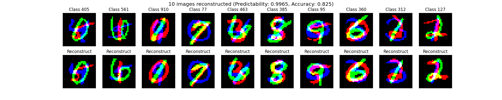
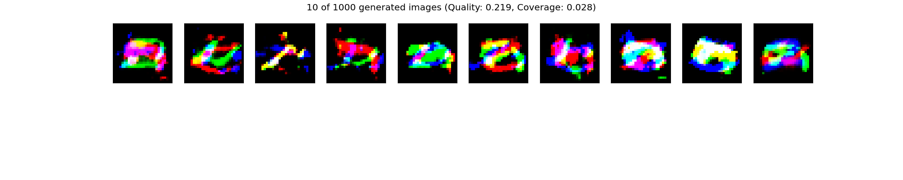
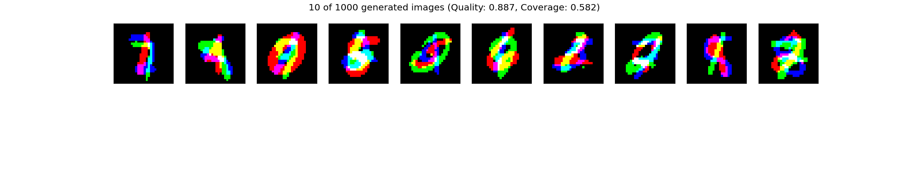
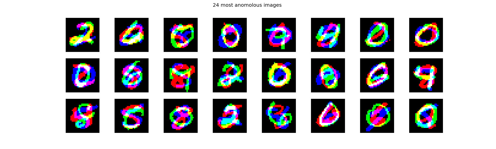

# Deep Generative Models 🔢

This project was part of the Deep Learning (IT3030) course at NTNU spring 2022. The aim of this project was to create and compare two deep generative models: standard autoencoder and variational autoencoder (VAE). The models, as well as a verification neural network, were trained on the standard MNIST dataset. Each model has three different modes:

## Modes

1. Basic: The model sends images through the encoder, and then decodes the encoding, thus reconstructing the original image.
2. Generative: Samples of encodings are taken from the latent space, and then decoded, thus generating completely new images.
3. Anomaly detection: The model (which is trained on an MNIST dataset without the number 8 in it) generates a set of images, and compare these to the test set (which contain all numbers including the number 8). The most anomolous images are shown.

Each mode can be performed either on the standard dataset (mono) or on the stacked dataset, where there are three color channels, each having its own number (stacked).

## Installation 📦

To install the required packages, use the following command: `pip install -r requirements.txt`

## Running the models

To run a model on a mode with either mono or stacked, run the main.py file with arguments: `python main.py <ae/vae> <basic/gen/anom> <mono/stacked>`. 

For example, to run the variational autoencoder in generative mode on stacked images you would run the following command: `python main.py vae gen stacked`

To run a model on the mono dataset, simply omit the last argument.

## Results ✅

Only the results for the stacked dataset are shown here, the results and findings are similar for the mono dataset and can be found in [results](results) folder.

### Basic

Autoencoder:

VAE:

Both models seem to be able to encode and decode to the correct numbers, however the standard autoencoder seem to produce fuzzy images, while the VAE is better at capturing the pixelation.

### Generative

Autoencoder:

VAE:

The VAE is clearly a much better generative model.

### Anomaly detection

Autoencoder:

VAE:

The standard autoencoder is more consisting at picking the anomolous number (8), while the VAE seem to react to the thickness of the numbers in the images.

## Future work 🚀

Further work on this project could include:

1. **Optimizing performance**: This especially relates to anomaly detection, where more extensive use of numpy functions could make this mode more time efficient.
2. **Train models on other datasets**: It could be interesting to test these autoencoders on datasets other than MNIST, especially the generative mode.
